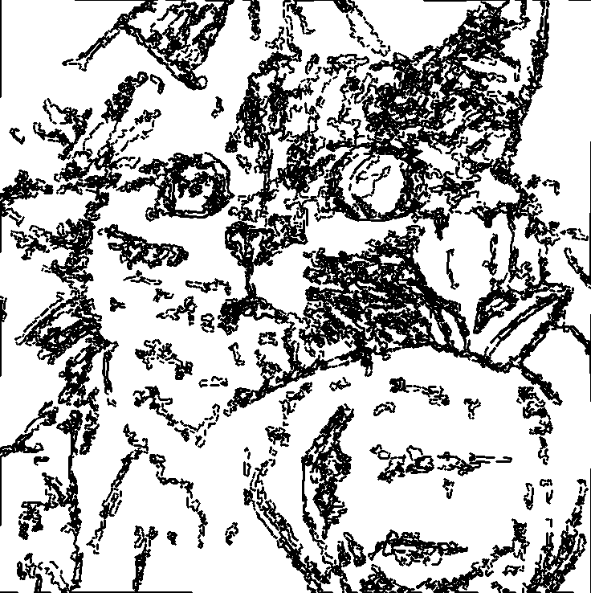

# Image Contour Extraction Web Application
- [Overview](#overview)
- [Features](#features)
- [Prerequisites](#prerequisites)
- [Installation](#installation)
- [Usage](#usage)
- [Dependencies](#dependencies)
- [Troubleshooting](#troubleshooting)
## Overview
Inspired by kevinjycui's DesmosBezierRenderer. This Flask web application provides an interface for extracting and visualizing image contours. It allows users to upload images and generate either mathematical expressions representing the contours or PNG images with traced contour lines.

## Features
- Upload images in PNG, JPG, WEBP, BMP, TIFF and JPEG formats
- Two output formats:
  1. Mathematical expressions of contours
  2. PNG image with traced contour lines
- Adjustable curve and background colors for png output

## Prerequisites
- Python version 3.9+
- pip

## Installation

### 1. Clone the Repository
```bash
git clone https://github.com/Hadidomena/Image-to-contours-Converter
cd Image-to-contours-Converter
```

### 2. Create a Virtual Environment (Recommended)
```bash
python3 -m venv venv
source venv/bin/activate  # On Windows, use `venv\Scripts\activate`
```

### 3. Install Dependencies
```bash
pip install -r requirements.txt
```

### 4. Run the Application
```bash
python app.py
```

The application will start and be accessible at `http://127.0.0.1:5000`

## Usage

1. Open the web application in your browser
2. Upload an image
3. Adjust parameters if desired:
   - Simplification Factor
   - Low and High Thresholds
   - Curve and Background Colors
   - Output Format
4. Example of output with recommended settings on an image of a cat.
<table align="center">
  <tr>
    <td>
      
    </td>
    <td>
      
    </td>
  </tr>
  <tr>
    <td align="center"><b>Cat Before</b></td>
    <td align="center"><b>Cat After</b></td>
  </tr>
</table>

### Optional: Recommended Settings
Click "Proceed with Recommended Settings" for automatic parameter optimization.

## Dependencies
- Flask
- OpenCV
- NumPy
- Potrace
- Other dependencies listed in `requirements.txt`

## Troubleshooting
- Ensure all dependencies are correctly installed
- Check that you're using Python 3.9+
- Verify image format
